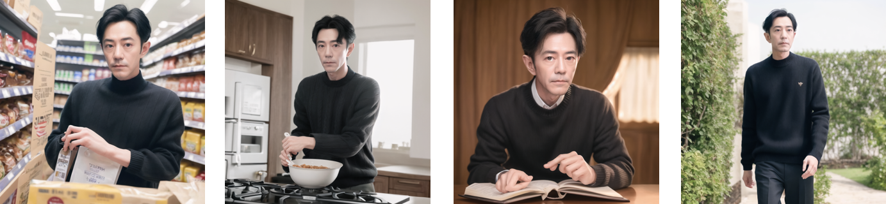
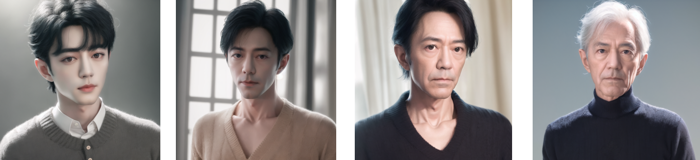
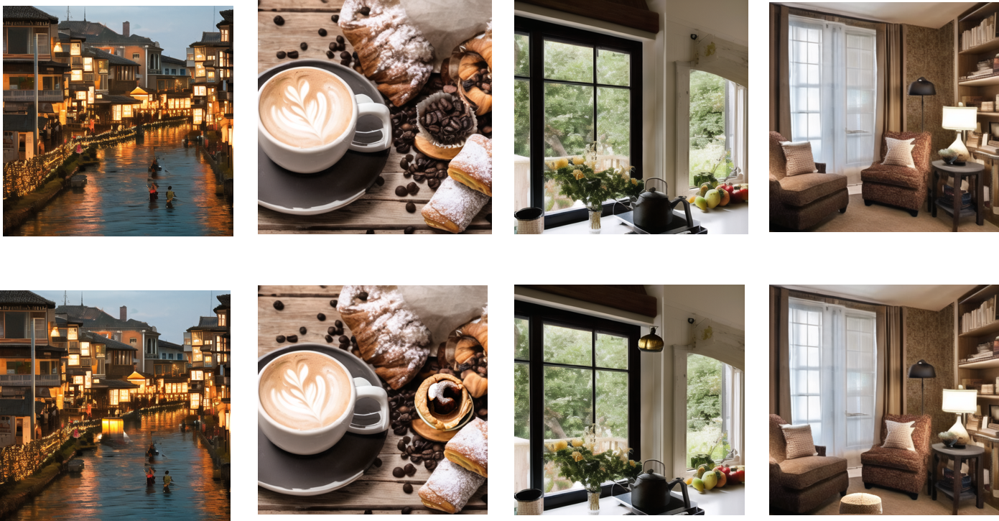
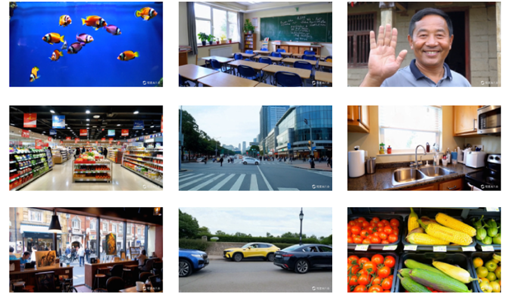

# 多模态AI认知康复训练

基于个性化生成模型与多模态AI技术，为认知障碍患者（特别是阿尔茨海默病患者）提供高度定制化的视觉、视频、音视频与VR康复训练内容，显著提升康复积极性和训练效果。

## Part 1：多维度认知康复训练刺激内容生成

情景回忆内容生成：利用ID一致的个性化生成模型,根据患者的少量照片，生成患者在熟悉场景中的图像（购物、做饭、看书、散步等），激发自传式记忆

年龄定制化照片生成：生成不同年龄段（少年、青年、中年、老年）的照片，帮助患者回忆人生不同阶段的自己与亲友

“找不同”注意力训练素材批量生成：通过图像编辑技术生成多组“找不同”素材，支持注意力集中与视觉搜索训练

生成的视觉刺激内容可灵活用于视空间能力、注意力、记忆力、逻辑推理：

为患者生成从未拍过的珍贵照片（如年轻时的结婚照、与已故亲人的合影等），提供强烈情感支持，显著激发回忆与积极情绪。

## Part 2：VR康复训练内容

专为认知与平衡障碍患者设计的VR训练场景，融合视觉空间、前庭觉、本体觉、感统处理等多模态刺激，帮助患者在沉浸式环境中进行认知训练：

## Part 3：个性化音视频故事生成

### 核心方案
结合患者亲友提供的2张照片 + 1段亲友语音 + 故事文字描述

AI自动生成：
1. 8-15个连续场景的个性化图像与短视频
2. 根据患者人生故事生成温暖叙述脚本
3. 使用亲友声音克隆合成旁白
4. 最终输出完整音视频故事

### 显著优势
- 基于回忆疗法（Reminiscence Therapy）的循证干预，对阿尔茨海默病患者情绪、认知功能有明确积极作用
- 多模态刺激（视觉+听觉+叙事）激活大脑多个区域协同工作，显著优于单一刺激
- 极高情感共鸣，患者常出现“这是我吗？”“他又回来陪我了”的强烈正面反应

### 示例故事：公园散步回忆（10场景）

